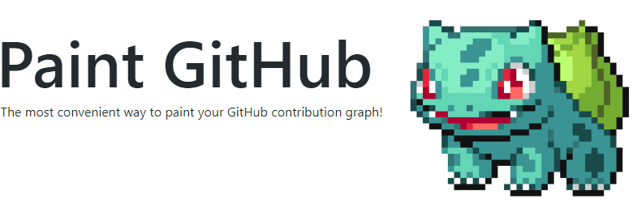

## Try it now: <a href="https://paintgithub.com" target="_blank">Paint GitHub</a>

  
  
    

## Usage
In order to use Paint GitHub, you must sign into Paint GitHub and allow Paint GitHub to access your repositories. Paint GitHub will persist your access token in order to create repositories and make commits to "paint" your contribution graph on your behalf. Persisting an access token is also required for a paint subscription. If there are any security concerns, please explicitly remove Paint GitHub from your Authorized OAuth Apps after painting your contribution graph.

## Features

### Paint: creates a private repository to paint your contribution graph

1. Choose any color 🎨
2. Paint your contribution graph 🖌️
3. Submit the paint job 🔒
4. Receive an email when the paint job is complete ✉️

### Subscribe: automatically paints your contribution graph everyday by making daily commits on your behalf

1. Choose a subscription level. The higher the level, the denser we will aim to color your contribution graph as the days pass. 📈
2. Within 24 hours you should see a new shade of green on the present day. If not, it means no commits were made today based on your chosen subscription level density. 🕒
3. Note: this does not paint your entire contribution graph outright. Subscribing will simply make daily commits on your behalf starting from the day of subscription. 📅

## Disclaimer

Paint GitHub is provided as is, and we make no promises or guarantees about this service. Paint GitHub is not affliated with GitHub in any way. Paint GitHub is not liable for any damages or losses arising from your use or inability to use the service.

## Built with
- [Firebase](https://firebase.google.com/)
- [React](https://reactjs.org/)
- [Redux](https://redux.js.org/)
- [Material UI](https://material-ui.com/)

## Creator
Andrew Li ([andrewmyli96@gmail.com](mailto:andrewmyli96@gmail.com)) 
